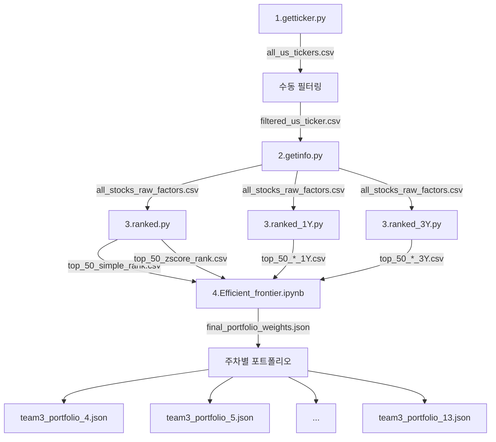

# Rebalance 코드 구조 분석

## 📁 디렉토리 구조
```
rebalabce/
├── ex/
│   └── 1final_portfolio_weights.json
├── 1.getticker.py
├── 2.getinfo.py
├── 3.ranked.py
├── 3.ranked_1Y.py
├── 3.ranked_3Y.py
├── 4.Efficient_frontier.ipynb
├── remove_tickers.py
├── all_us_tickers.csv
├── filtered_us_ticker.csv
├── all_stocks_raw_factors.csv
├── all_stocks_raw_factors_filtered.csv
├── top_50_simple_rank.csv
├── top_50_zscore_rank.csv
├── top_50_simple_rank_1Y.csv
├── top_50_zscore_rank_1Y.csv
├── top_50_simple_rank_3Y.csv
├── top_50_zscore_rank_3Y.csv
├── top_50+50.csv
├── final_portfolio_weights.json
├── portfolio_weights_65_risk.json
├── portfolio_weights_max_sharpe.json
└── team3_portfolio_{4-13}.json (주차별 포트폴리오)
```

---

## 🔄 데이터 파이프라인

### **1단계: 티커 수집** (`1.getticker.py`)
```
Input: None
Process: 
  - finvizfinance API 사용
  - NASDAQ, NYSE, AMEX 거래소에서 티커 수집
  - 중복 제거 및 정렬
Output: all_us_tickers.csv
```

**주요 기능:**
- 3대 거래소 전체 티커 크롤링
- 중복 제거 및 알파벳 정렬

---

### **2단계: 팩터 데이터 수집** (`2.getinfo.py`)
```
Input: filtered_us_ticker.csv
Process:
  - yfinance API로 3년치 주가/재무 데이터 수집
  - 9가지 팩터 계산 (1Y/3Y 모멘텀, 변동성 포함)
  - 필터링: 주식 타입, 데이터 충분성, 필수 정보 존재 여부
Output: all_stocks_raw_factors.csv
```

**수집 팩터 (9개):**
| 팩터 | 설명 | 방향성 |
|------|------|--------|
| Beta | 시장 민감도 | 낮을수록 좋음 |
| Momentum_1Y | 1년 수익률 | 높을수록 좋음 |
| Momentum_3Y | 3년 수익률 | 높을수록 좋음 |
| Value_PBR | 주가순자산비율 | 낮을수록 좋음 |
| Volatility_1Y | 1년 변동성 | 낮을수록 좋음 |
| Volatility_3Y | 3년 변동성 | 낮을수록 좋음 |
| Size_MarketCap | 시가총액 | 낮을수록 좋음 |
| Profitability_ROE | 자기자본이익률 | 높을수록 좋음 |
| Investment_AssetGrowth | 총자산 증가율 | 낮을수록 좋음 |

**필터링 조건:**
1. quoteType == 'EQUITY'
2. PBR, Beta 정보 존재
3. 3년치 데이터 (최소 750일)
4. 모든 팩터 값 존재
5. 수동 제외 티커 리스트 (상장폐지 예정 등)

---

### **3단계: 순위 산정** (`3.ranked.py`, `3.ranked_1Y.py`, `3.ranked_3Y.py`)

#### **3.ranked.py** (혼합 버전)
```
Input: all_stocks_raw_factors.csv
Process:
  - 방법1: Simple Rank (순위 합산)
  - 방법2: Z-Score (표준화 점수 합산)
  - 1Y/3Y 팩터 모두 사용
Output: 
  - top_50_simple_rank.csv
  - top_50_zscore_rank.csv
```

#### **3.ranked_1Y.py** (1년 기준)
```
사용 팩터: Beta, Value_PBR, Volatility_1Y, Size_MarketCap, 
          Investment_AssetGrowth, Momentum_1Y, Profitability_ROE
Output:
  - top_50_simple_rank_1Y.csv
  - top_50_zscore_rank_1Y.csv
```

#### **3.ranked_3Y.py** (3년 기준)
```
사용 팩터: Beta, Value_PBR, Volatility_3Y, Size_MarketCap,
          Investment_AssetGrowth, Momentum_3Y, Profitability_ROE
Output:
  - top_50_simple_rank_3Y.csv
  - top_50_zscore_rank_3Y.csv
```

**순위 산정 방법:**

1. **Simple Rank (단순 순위)**
   - 각 팩터별 순위 계산
   - 순위 합산 → 낮을수록 좋음

2. **Z-Score (표준화 점수)**
   - 각 팩터 표준화: `(값 - 평균) / 표준편차`
   - 방향성 통일 (낮을수록 좋은 팩터는 -1 곱함)
   - Z-Score 합산 → 높을수록 좋음

---

### **4단계: 포트폴리오 최적화** (`4.Efficient_frontier.ipynb`)
```
Input: top_50_*.csv
Process:
  - 효율적 투자선(Efficient Frontier) 계산
  - 샤프 비율 최대화
  - 리스크 제약 조건 적용
Output:
  - final_portfolio_weights.json
  - portfolio_weights_max_sharpe.json
  - portfolio_weights_65_risk.json
```

---

### **보조 스크립트: 티커 제거** (`remove_tickers.py`)
```
Input: top_50_zscore_rank_3Y.csv
Process: 상장폐지 예정 종목 필터링
Output: all_stocks_raw_factors_filtered.csv
```

---

## 📊 데이터 흐름도



---

## 📦 주차별 포트폴리오 파일

**형식:** `team3_portfolio_{주차번호}.json`

**존재하는 주차:** 4, 5, 6, 7, 8, 9, 10, 11, 12, 13

**예시 (team3_portfolio_13.json):**
```json
{
    "CLS": 0.223,
    "MONEY": 0.7,
    "APP": 0.01,
    "PTGX": 0.009,
    "MAMA": 0.008,
    ...
}
```

**특징:**
- 가중치 합계 = 1.0
- MONEY: 현금 비중 (70%)
- 나머지: 개별 종목 비중

---

## 🔑 핵심 알고리즘

### 1. 팩터 계산
```python
# 모멘텀 (1년)
momentum_1y = (price_now / price_1y_ago) - 1

# 변동성 (1년)
volatility_1y = daily_returns[-252:].std()

# 자산 증가율
asset_growth = (total_assets_now - total_assets_prev) / abs(total_assets_prev)
```

### 2. Z-Score 표준화
```python
z_score = (value - mean) / std

# 방향성 통일
if lower_is_better:
    z_score *= -1
```

### 3. 종합 점수
```python
# Simple Rank
composite_score = sum(all_factor_ranks)  # 낮을수록 좋음

# Z-Score
composite_score = sum(all_factor_z_scores)  # 높을수록 좋음
```

---

## 🛠️ 사용 라이브러리

- **finvizfinance**: 티커 수집
- **yfinance**: 주가/재무 데이터
- **pandas**: 데이터 처리
- **numpy**: 수치 계산
- **scipy/cvxpy** (추정): 포트폴리오 최적화

---

## 📝 실행 순서

1. `python 1.getticker.py` → 티커 수집
2. 수동으로 `filtered_us_ticker.csv` 생성
3. `python 2.getinfo.py` → 팩터 데이터 수집
4. `python 3.ranked_1Y.py` → 1년 기준 순위
5. `python 3.ranked_3Y.py` → 3년 기준 순위
6. `jupyter notebook 4.Efficient_frontier.ipynb` → 포트폴리오 최적화
7. 주차별로 `team3_portfolio_{주차}.json` 업데이트

---

## ⚠️ 주의사항

1. **API 제한**: yfinance 호출 시 1-2초 딜레이 필수
2. **데이터 품질**: 3년 미만 데이터는 자동 제외
3. **수동 관리**: 상장폐지 예정 종목은 수동으로 제외 리스트 관리
4. **파일 의존성**: 각 단계는 이전 단계의 출력 파일 필요
